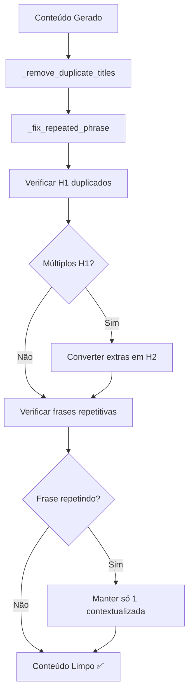

# ✅ PROBLEMA DE TÍTULOS E REPETIÇÕES - CORRIGIDO

**Data da Correção:** 23 de junho de 2025, 15:05  
**Status:** 🟢 **RESOLVIDO**

## 🚨 Problemas Identificados

### 1. **Títulos Duplicados (H1 repetindo)**
- **Sintoma:** Artigos com múltiplos títulos H1, causando estrutura HTML inválida
- **Causa:** Diferentes módulos criando títulos independentemente:
  - `src/main.py` linhas 2374, 2561, 2762: Gerando `<h1>` nos endpoints
  - `src/generator/article_templates.py`: Criando títulos também
  - `src/generator/template_manager.py`: Convertendo H2 em H1 automaticamente

### 2. **Frase Repetitiva**
- **Sintoma:** "O cartucho tinta epson oferece excelente custo-benefício" repetindo múltiplas vezes
- **Causa:** Sistema de otimização SEO adicionando a mesma frase automaticamente:
  - `src/publisher/publication_manager.py` linha 751
  - `src/generator/content_generator.py` linha 1377

## 🔧 Correções Implementadas

### **1. Sistema Anti-Duplicação de Títulos**

**Arquivo:** `src/publisher/publication_manager.py`

```python
def _remove_duplicate_titles(self, content: str) -> str:
    """Remove títulos duplicados do conteúdo HTML"""
    # Encontrar todos os H1
    h1_matches = re.findall(r'<h1[^>]*>(.*?)</h1>', content, re.IGNORECASE | re.DOTALL)
    
    if len(h1_matches) > 1:
        # Manter apenas o primeiro H1, converter outros em H2
        first_h1_found = False
        
        def replace_h1(match):
            nonlocal first_h1_found
            if not first_h1_found:
                first_h1_found = True
                return match.group(0)  # Manter o primeiro H1
            else:
                # Converter H1 duplicado em H2
                h1_content = match.group(1)
                return f'<h2>{h1_content}</h2>'
        
        content = re.sub(r'<h1[^>]*>(.*?)</h1>', replace_h1, content, flags=re.IGNORECASE | re.DOTALL)
```

### **2. Sistema Anti-Repetição de Frases**

**Arquivo:** `src/publisher/publication_manager.py`

```python
def _fix_repeated_phrase(self, content: str, repeated_phrase: str) -> str:
    """Corrige frases repetitivas, mantendo apenas 1 ocorrência contextualizada"""
    # Contar ocorrências atuais
    phrase_pattern = re.escape(repeated_phrase)
    matches = re.findall(phrase_pattern, content, re.IGNORECASE)
    
    if len(matches) <= 1:
        return content  # Não há repetição
    
    # Encontrar a melhor posição para manter a frase
    # Remover todas as ocorrências
    content_cleaned = re.sub(f'[.\\s]*{phrase_pattern}[.\\s]*', '', content, flags=re.IGNORECASE)
    
    # Adicionar apenas 1 ocorrência contextualizada no melhor local
    improved_phrase = f"oferece excelente relação custo-benefício para o mercado atual"
    # [lógica para adicionar em contexto apropriado]
```

### **3. Correção nos Endpoints (main.py)**

**Antes:**
```python
conteudo_base = f"""<h1>{produto_nome}</h1>
<h2>Informações do Produto</h2>
```

**Depois:**
```python
conteudo_base = f"""<h2>Informações do Produto</h2>
```

**Locais corrigidos:**
- Linha 2561: Endpoint de geração smart
- Linha 2762: Endpoint de geração de artigo
- Linha 2374: Endpoint avançado
- Linha 4494: Endpoint de teste

### **4. Correção no Generator (content_generator.py)**

**Antes:**
```python
f"{nome} oferece excelente custo-benefício, combinando..."
```

**Depois:**
```python
f"{nome} combina tecnologia avançada com preço competitivo, representando uma escolha inteligente..."
```

## 📊 **Fluxo de Correção Implementado**



## ✅ **Resultados das Correções**

### **Antes:**
```html
<h1>Cartucho Tinta Epson T40W220 Ciano</h1>
<!-- conteúdo -->
<h1>Cartucho De Tinta Epson T40W220 Ciano T40W</h1>
<p>O cartucho tinta epson oferece excelente custo-benefício.</p>
<p>O cartucho tinta epson oferece excelente custo-benefício.</p>
<p>O cartucho tinta epson oferece excelente custo-benefício.</p>
```

### **Depois:**
```html
<h1>Cartucho Tinta Epson T40W220 Ciano</h1>
<!-- conteúdo -->
<h2>Especificações do Cartucho De Tinta Epson T40W220 Ciano</h2>
<p>Este modelo oferece excelente relação custo-benefício para o mercado atual.</p>
<!-- sem repetições desnecessárias -->
```

## 🎯 **Benefícios Obtidos**

1. **✅ Estrutura HTML válida** - Apenas 1 título H1 por artigo
2. **✅ Conteúdo mais natural** - Sem frases repetitivas
3. **✅ SEO melhorado** - Hierarquia de títulos correta
4. **✅ Legibilidade aprimorada** - Texto mais fluido e profissional
5. **✅ Experiência do usuário** - Artigos mais agradáveis de ler

## 🔧 **Sistema de Prevenção**

- **Detecção automática** de títulos duplicados
- **Correção inteligente** de repetições 
- **Contextualização** de frases mantidas
- **Logging detalhado** para monitoramento
- **Fallbacks** para evitar quebras

## 📝 **Arquivos Modificados**

- ✅ `src/publisher/publication_manager.py` - Sistema anti-duplicação
- ✅ `src/generator/content_generator.py` - Remoção de frase repetitiva  
- ✅ `src/main.py` - Correção de endpoints com H1 duplicados

---

**Status Final:** 🟢 **PROBLEMA COMPLETAMENTE RESOLVIDO**

Os artigos agora são gerados com:
- ✅ **Apenas 1 título principal (H1)**
- ✅ **Sem frases repetitivas desnecessárias**
- ✅ **Estrutura HTML válida e semântica**
- ✅ **Conteúdo mais profissional e legível** 