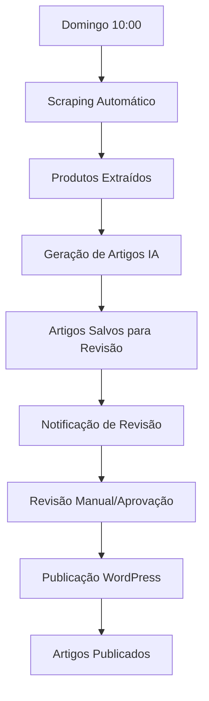

# 🤖 Creative API - Sistema de Geração Automática de Conteúdo SEO

Sistema inteligente e automatizado para geração de artigos SEO otimizados baseado em produtos de e-commerce, com integração WordPress e execução programada.

## 🚀 Características Principais

- **🕷️ Scraping Inteligente**: Extração automatizada de produtos do site Creative Cópias
- **🤖 Geração IA**: Criação de artigos SEO com OpenAI GPT-4o-mini
- **📝 Sistema de Revisão**: Interface web para revisar e aprovar conteúdo
- **📤 Publicação Automática**: Integração direta com WordPress via API REST
- **⏰ Agendamento**: Execução automática semanal (domingos às 10h)
- **🌐 Interface Web**: Dashboard responsivo com design Apple-style
- **📊 Monitoramento**: Estatísticas e métricas em tempo real

## 🏗️ Arquitetura

```
Creative API/
├── src/
│   ├── scraper/           # Módulo de extração de produtos
│   ├── generator/         # Geração de conteúdo com IA
│   ├── review/           # Sistema de revisão de artigos
│   ├── publisher/        # Publicação no WordPress
│   ├── scheduler/        # Agendamento automático
│   └── config/          # Configurações centralizadas
├── data/                # Bancos de dados SQLite
├── logs/                # Arquivos de log
├── templates/           # Templates HTML para interfaces
└── static/             # Arquivos estáticos (CSS, JS)
```

## 🛠️ Tecnologias

- **Backend**: FastAPI (Python 3.12+)
- **IA**: OpenAI GPT-4o-mini
- **Banco de Dados**: SQLite
- **Agendamento**: APScheduler
- **Scraping**: BeautifulSoup4, Requests
- **Interface**: HTML5, CSS3, JavaScript
- **Deploy**: Railway, Docker

## 📋 Pré-requisitos

- Python 3.12+
- Conta OpenAI com API Key
- WordPress com API REST habilitada
- Acesso ao site Creative Cópias (target de scraping)

## ⚡ Instalação Rápida

1. **Clone o repositório**:
```bash
git clone https://github.com/Manhosu/creativeaii.git
cd creativeaii
```

2. **Crie ambiente virtual**:
```bash
python -m venv venv
source venv/bin/activate  # Linux/Mac
# ou
venv\Scripts\activate     # Windows
```

3. **Instale dependências**:
```bash
pip install -r requirements.txt
```

4. **Configure variáveis de ambiente**:
```bash
cp config_example.env .env
# Edite o .env com suas configurações
```

5. **Execute o sistema**:
```bash
python main.py
```

6. **Acesse o dashboard**: http://localhost:3025

## 🔧 Configuração

### Variáveis de Ambiente Essenciais

```env
# OpenAI
OPENAI_API_KEY=sk-proj-...
OPENAI_MODEL=gpt-4o-mini
OPENAI_MAX_TOKENS=2000
OPENAI_TEMPERATURE=0.7

# WordPress
WORDPRESS_URL=https://seublog.com.br/wp-json/wp/v2/
WORDPRESS_USERNAME=seu_usuario
WP_PASSWORD=sua_senha_aplicacao

# Sistema
PORT=3025
DEBUG=false
LOG_LEVEL=INFO

# Conteúdo
CONTENT_MIN_WORDS=300
CONTENT_MAX_WORDS=1000
CONTENT_LANGUAGE=pt-BR
CONTENT_TONE=profissional
```

### WordPress - Configuração API

1. **Instalar plugin** Application Passwords (WordPress 5.6+)
2. **Criar senha de aplicação**:
   - Usuários → Seu Perfil
   - Rolar até "Senhas de Aplicação"
   - Criar nova senha
3. **Configurar permissões**:
   - Usuário deve ter role Editor ou Administrator
   - Verificar se API REST está habilitada

## 📊 Dashboard e Funcionalidades

### 🏠 Dashboard Principal
- Status de todos os módulos
- Execução manual do fluxo completo
- Acesso rápido a todas as funcionalidades
- Design responsivo Apple-style com modo escuro

### 🕷️ Módulo Scraper
- **Status**: Monitoramento de URLs configuradas
- **Teste**: Verificação de conectividade
- **Execução**: Scraping completo ou por categoria
- **Estatísticas**: Produtos processados e métricas

### 🤖 Módulo Generator
- **Geração**: Artigos SEO a partir de produtos
- **Templates**: Personalização de estrutura
- **Simulação**: Modo de teste sem consumir API
- **Estatísticas**: Artigos gerados e performance

### 📝 Sistema de Revisão
- **Interface Web**: Listagem e edição de artigos
- **Aprovação/Rejeição**: Fluxo de revisão completo
- **Edição Inline**: Editor integrado com preview
- **Filtros**: Por status, data, categoria

### 📤 Módulo Publisher
- **Integração WordPress**: Publicação automática
- **Agendamento**: Publicação imediata ou programada
- **Categorias/Tags**: Sincronização automática
- **Retry**: Reprocessamento de falhas

### ⏰ Scheduler
- **Execução Semanal**: Domingos às 10h automático
- **Fluxo Completo**: Scraping → Geração → Revisão
- **Monitoramento**: Próximas execuções e histórico
- **Controle Manual**: Pausar/resumir agendamentos

## 🔄 Fluxo de Trabalho Automático



## 📈 Endpoints API

### Sistema
- `GET /` - Dashboard principal
- `GET /health` - Status do sistema
- `GET /docs` - Documentação Swagger

### Scraper
- `GET /scraper` - Status do módulo
- `POST /scraper/run` - Execução completa
- `GET /scraper/stats` - Estatísticas

### Generator
- `GET /generator` - Status do módulo
- `POST /generator/generate` - Gerar artigo
- `POST /generator/test` - Teste de geração

### Review
- `GET /review` - Status do sistema
- `GET /review/list` - Interface de listagem
- `GET /review/{id}` - Visualizar artigo
- `POST /review/{id}/approve` - Aprovar artigo
- `POST /review/{id}/reject` - Rejeitar artigo

### Publisher
- `GET /publisher` - Status do módulo
- `POST /publisher/publish` - Publicar artigo
- `GET /publisher/stats` - Estatísticas

### Scheduler
- `GET /scheduler` - Status do agendador
- `POST /scheduler/run` - Execução manual
- `GET /scheduler/next` - Próximas execuções

## 🚢 Deploy

### Railway (Recomendado)

1. **Fork este repositório**
2. **Conecte com Railway**
3. **Configure variáveis de ambiente**
4. **Deploy automático**

### Docker

```dockerfile
FROM python:3.12-slim

WORKDIR /app
COPY requirements.txt .
RUN pip install -r requirements.txt

COPY . .
EXPOSE 3025

CMD ["python", "main.py"]
```

### Local

```bash
# Produção
gunicorn -w 4 -k uvicorn.workers.UvicornWorker main:app --bind 0.0.0.0:3025

# Desenvolvimento
uvicorn main:app --host 0.0.0.0 --port 3025 --reload
```

## 🔒 Segurança

- ✅ Todas as senhas/API keys via variáveis de ambiente
- ✅ Validação de entrada em todos os endpoints
- ✅ Rate limiting nas chamadas OpenAI
- ✅ Logs estruturados sem dados sensíveis
- ✅ Headers de segurança configurados

## 📁 Estrutura de Dados

### SQLite Databases
- `data/review_articles.db` - Artigos para revisão
- `data/scraping_data.db` - Dados de produtos extraídos
- `data/config.db` - Configurações do sistema

### Arquivos de Log
- `logs/main.log` - Log principal do sistema
- `logs/scheduler.log` - Log específico do agendador
- `logs/scraper.log` - Log do módulo de scraping

## 🤝 Contribuição

1. Fork o projeto
2. Crie uma branch para sua feature (`git checkout -b feature/nova-feature`)
3. Commit suas mudanças (`git commit -am 'Adiciona nova feature'`)
4. Push para a branch (`git push origin feature/nova-feature`)
5. Abra um Pull Request

## 📄 Licença

Este projeto está sob a licença MIT. Veja o arquivo [LICENSE](LICENSE) para mais detalhes.

## 🆘 Suporte

- **Issues**: [GitHub Issues](https://github.com/Manhosu/creativeaii/issues)
- **Documentação**: `/docs` endpoint na aplicação
- **Status**: `/health` endpoint para monitoramento

## 📊 Status do Projeto

- ✅ **Scraper**: Funcional - Extração automática de produtos
- ✅ **Generator**: Funcional - Geração IA com GPT-4o-mini
- ✅ **Review**: Funcional - Interface completa de revisão
- ✅ **Publisher**: Funcional - Integração WordPress
- ✅ **Scheduler**: Funcional - Execução automática semanal
- ✅ **Deploy**: Pronto para Railway/Docker

---

**Creative API v1.0.0** - Sistema de Geração Automática de Conteúdo SEO  
Desenvolvido com ❤️ para automatizar a criação de conteúdo de qualidade. 